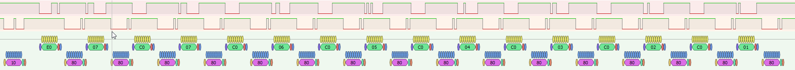
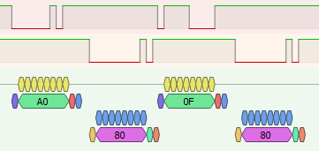
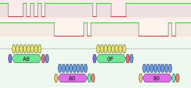

# BA80 Keyboard
## Interface
The interface between the Keyboard and the VDU (Visual Display Unit) is a 5V logic level UART with the following parameters:
```text
4800 Baud
8 Data bits
1 Stop bit
Odd Parity
```
The keyboard is also responsible for turning the VDU on and off. This is done by a separate Button on the keyboard.
The button shorts the NEN signal to ground. After this, the main power supply is coming up and the keyboard is powered with 5V DC.

The keyboard is connected to the VDU through a 6-pin Tuchel connector with the following pinout:
```text

        _____ _____           Pin no.   cable color     signal
      /      V      \         1         white           TX data (keyboard to BA80)
     / 5 O       O 1 \        2         yellow          +24V (not used)
    |      6 O        |       3         gray            Ground
    |  4 O       O 2  |       4         green           power on
     \     3 O       /        5         brown           RX data (BA80 to keyboard)
       \ _________ /          6         pink            +5V

view to soldering side of the connector
```

## Logic Analyzer Captures

This is a collection of logic analyzer captures of the communication between the keyboard and the VDU.
Row odering:
1. raw bits transmitted by the keyboard
2. raw bits transmitted by the VDU
3. decoded data (UART) transmitted by the keyboard
4. decoded data (UART) transmitted by the VDU

### Initialization sequence


### F1 key pressed


### F1 key released



## Commands

| Sender | Code  | Description    | Remarks                                            |
|--------|-------|----------------|----------------------------------------------------|
| KEY    | A0    | key pressed    | Followed by the key code of the pressed key.       |
| KEY    | A8    | key released   | Followed by the key code of the released key.      |
| KEY    | F0    | keyboard ready | Sent after power up until until first `VDU ready` every 50ms. |
| KEY    | C0 20 | power off      |
| VDU    | 10    | VDU ready      |
| VDU    | 80    | ACK            |


## Keyboard layout and key codes

The first text row of each key is the label of the key, second row is the key code.

```text
+----+ +----+   +--------+ +--------+ +--------+   +--------+ +--------+ +--------+   +--------+ +--------+ +---------+   +----+ +----+ +----+ +----+ +----+ +----+ +----+ +----+
| ESC| | !  |   | F1     | | F2     | | F3     |   | F4     | | F5     | | F6     |   | F7     | | F8     | | F9      |   | END| | X1 | | X2 | | X3 | | ?  | | i  | |CWIN| | LOC|
| 3F | | 1F |   | 0F     | | 0B     | | 07     |   | 0E     | | 0A     | | 02     |   | 09     | | 05     | | 11      |   | 0C | | 1C | | 08 | | 18 | | 04 | | 14 | | 00 | | 10 |
+----+ +----+   +--------+ +--------+ +--------+   +--------+ +--------+ +--------+   +--------+ +--------+ +---------+   +----+ +----+ +----+ +----+ +----+ +----+ +----+ +----+

+----+ +----+   +----+ +----+ +----+ +----+ +----+ +----+ +----+ +----+ +----+ +----+ +----+ +----+ +----+ +----------+   +----+ +----+ +----+     +----+ +----+ +----+    +----+
| LF1| | LF2|   | <^ | | 1! | | 2" | | 3§ | | 4$ | | 5% | | 6& | | 7/ | | 8( | | 9) | | 0= | | ß? | | ´` | | <---     |   | X4 | | INS| | Y  |     | C  | | %  | | /  |    | *  |
| 4F | | 2F |   | 3B | | 2B | | 27 | | 17 | | 13 | | 1E | | 1A | | 16 | | 12 | | 1D | | 19 | | 29 | | 15 | | 25       |   | 21 | | 31 | | 2C |     | 28 | | 24 | | 20 |    | 30 |
+----+ +----+   +----+ +----+ +----+ +----+ +----+ +----+ +----+ +----+ +----+ +----+ +----+ +----+ +----+ +----------+   +----+ +----+ +----+     +----+ +----+ +----+    +----+
+----+ +----+   +--------+ +----+ +----+ +----+ +----+ +----+ +----+ +----+ +----+ +----+ +----+ +----+ +----+ +------+   +----+ +----+ +----+     +----+ +----+ +----+    +----+
| LF3| | LF4|   | TAB    | | Q  | | W  | | E  | | R  | | T  | | Z  | | U  | | I  | | O  | | P  | | Ü  | | +* | | RET  |   | X5 | | DEL| | N  |     | 7  | | 8  | | 9  |    | -  |
| 5F | | 5B |   | 4B     | | 37 | | 43 | | 33 | | 23 | | 2E | | 2A | | 26 | | 22 | | 2D | | 3D | | 39 | | 49 | | 35   |   | 45 | | 41 | | 3C |     | 38 | | 34 | | 40 |    | 50 |
+----+ +----+   +--------+ +----+ +----+ +----+ +----+ +----+ +----+ +----+ +----+ +----+ +----+ +----+ +----+ +-+    |   +----+ +----+ +----+     +----+ +----+ +----+    +----+
+----+ +----+   +----------+ +----+ +----+ +----+ +----+ +----+ +----+ +----+ +----+ +----+ +----+ +----+ +----+ |    |          +----+            +----+ +----+ +----+    +----+
| LF5| | LF6|   | CAPSLOCK | | A  | | S  | | D  | | F  | | G  | | H  | | J  | | K  | | L  | | Ö  | | Ä  | | #^ | |    |          | ^  |            | 4  | | 5  | | 6  |    | +  |
| 6F | | 6B |   | 47       | | 53 | | 5E | | 4E | | 3E | | 3A | | 36 | | 32 | | 42 | | 52 | | 4D | | 5D | | 59 | |    |          | 51 |            | 48 | | 44 | | 54 |    | 60 |
+----+ +----+   +----------+ +----+ +----+ +----+ +----+ +----+ +----+ +----+ +----+ +----+ +----+ +----+ +----+ +----+          +----+            +----+ +----+ +----+    +----+
+----+ +----+   +------+ +----+ +----+ +----+ +----+ +----+ +----+ +----+ +----+ +----+ +----+ +----+ +--------+ +----+   +----+ +----+ +----+     +----+ +----+ +----+    +----+
| LF7| | LF8|   | SHIF | | <> | | Y  | | X  | | C  | | V  | | B  | | N  | | M  | | ,; | | .: | | -_ | | SHIFT  | | @' |   | <  | | X6 | | >  |     | 1  | | 2  | | 3  |    |    |
| 7F | | 7B |   | 57   | | 63 | | 6E | | 7A | | 6A | | 5A | | 4A | | 46 | | 56 | | 66 | | 62 | | 72 | | 6D     | | 69 |   | 65 | | 61 | | 5C |     | 58 | | 68 | | 64 |    |  R |
+----+ +----+   +------+ +----+ +----+ +----+ +----+ +----+ +----+ +----+ +----+ +----+ +----+ +----+ +--------+ +----+   +----+ +----+ +----+     +----+ +----+ +----+    |  E |
+----+ +----+   +---------+  +---------+ +-----------------------------------------------------+ +---------+ +--------+          +----+            +-----------+ +----+    |  T |
| LF9| |LF10|   | CTRL    |  | ALT     | | SPACE                                               | | ALT     | | TC     |          | v  |            | 0         | | ,  |    |    |
| 77 | | 67 |   | 73      |  | 7E      | | 76                                                  | | 7D      | | 79     |          | 71 |            | 7C        | | 74 |    | 70 |
+----+ +----+   +---------+  +---------+ +-----------------------------------------------------+ +---------+ +--------+          +----+            +-----------+ +----+    +----+
```
